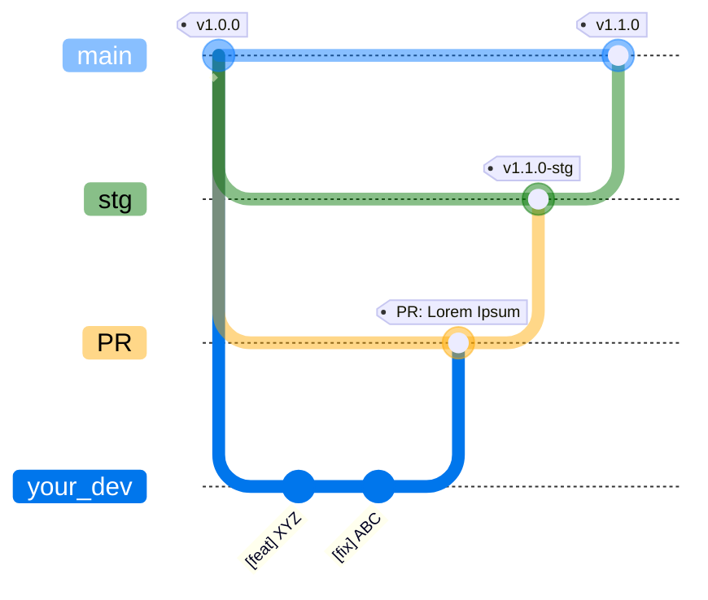
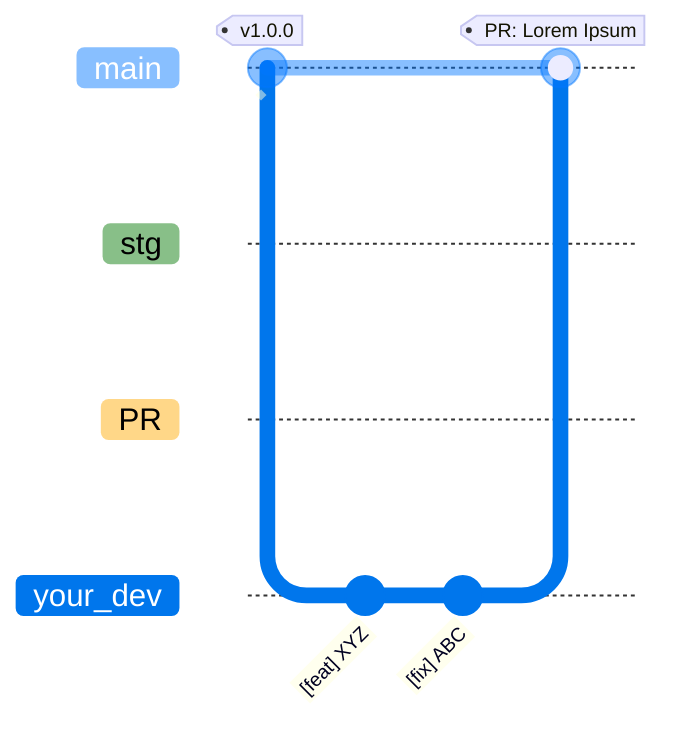
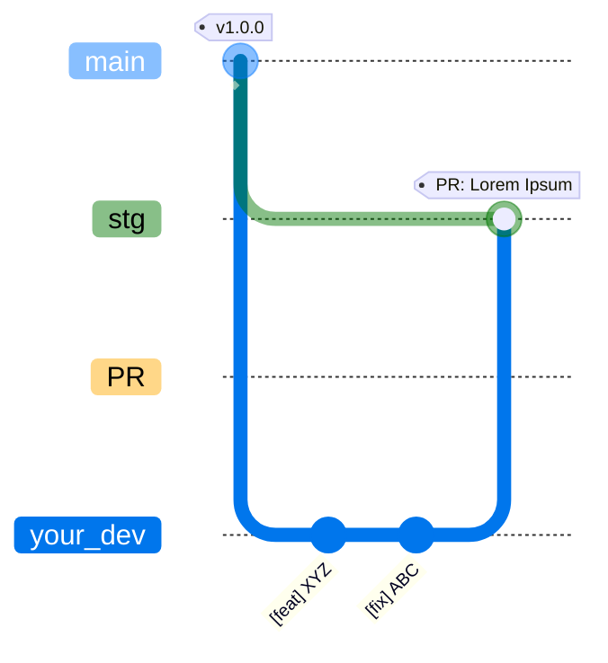

# Contributing Guidelines

_Pull requests, bug reports, and all other forms of contribution are welcomed and highly encouraged!_

> **This guide serves to set clear expectations for everyone involved with the project so that we can improve it together while also creating a welcoming space for everyone to participate. Following these guidelines will help ensure a positive experience for contributors and maintainers.**

## Code of Conduct

Please review our [Code of Conduct](https://lucasgoncsilva.github.io/swarden/CODE_OF_CONDUCT). It is in effect at all times. We expect it to be honored by everyone who contributes to this project. Acting like an asshole will not be tolerated.

## Asking Questions

See our [Support Guide](https://lucasgoncsilva.github.io/swarden/SUPPORT). In short, GitHub issues are not the appropriate place to debug your specific project, but should be reserved for filing bugs and feature requests.

## Opening an Issue

Before [creating an issue](https://help.github.com/en/github/managing-your-work-on-github/creating-an-issue), check if you are using the latest version of the project. If you are not up-to-date, see if updating fixes your issue first.

### Reporting Security Issues

Review our [Security Policy](https://lucasgoncsilva.github.io/swarden/SECURITY). **Do not** file a public issue for security vulnerabilities.

### Bug Reports and Other Issues

A great way to contribute to the project is to send a detailed issue when you encounter a problem. We always appreciate a well-written, thorough bug report.

In short, since you are most likely a developer, **provide a ticket that you would like to receive**.

- **Review the documentation and [Support Guide](https://lucasgoncsilva.github.io/swarden/SUPPORT)** before opening a new issue.

- **Do not open a duplicate issue!** Search through existing issues to see if your issue has previously been reported. If your issue exists, comment with any additional information you have. You may simply note "I have this problem too", which helps prioritize the most common problems and requests.

- **Prefer using [reactions](https://github.blog/2016-03-10-add-reactions-to-pull-requests-issues-and-comments/)**, not comments, if you simply want to "+1" an existing issue.

- **Fully complete the provided issue template.** The bug report template requests all the information we need to quickly and efficiently address your issue. Be clear, concise, and descriptive. Provide as much information as you can, including steps to reproduce, stack traces, compiler errors, library versions, OS versions, and screenshots (if applicable).

- **Use [GitHub-flavored Markdown](https://help.github.com/en/github/writing-on-github/basic-writing-and-formatting-syntax).** Especially put code blocks and console outputs in backticks (```). This improves readability.

## Feature Requests

Feature requests are welcome! While we will consider all requests, we cannot guarantee your request will be accepted. We want to avoid [feature creep](https://en.wikipedia.org/wiki/Feature_creep). Your idea may be great, but also out-of-scope for the project. If accepted, we cannot make any commitments regarding the timeline for implementation and release. However, you are welcome to submit a pull request to help!

- **Do not open a duplicate feature request.** Search for existing feature requests first. If you find your feature (or one very similar) previously requested, comment on that issue.

- **Fully complete the provided issue template.** The feature request template asks for all necessary information for us to begin a productive conversation.

- Be precise about the proposed outcome of the feature and how it relates to existing features. Include implementation details if possible.

## Triaging Issues

You can triage issues which may include reproducing bug reports or asking for additional information, such as version numbers or reproduction instructions. Any help you can provide to quickly resolve an issue is very much appreciated!

## Submitting Pull Requests

We **love** pull requests! Before [forking the repo](https://help.github.com/en/github/getting-started-with-github/fork-a-repo) and [creating a pull request](https://help.github.com/en/github/collaborating-with-issues-and-pull-requests/proposing-changes-to-your-work-with-pull-requests) for non-trivial changes, it is usually best to first open an issue to discuss the changes, or discuss your intended approach for solving the problem in the comments for an existing issue.

For most contributions, after your first pull request is accepted and merged, you will be [invited to the project](https://help.github.com/en/github/setting-up-and-managing-your-github-user-account/inviting-collaborators-to-a-personal-repository) and given **push access**.

_Note: All contributions will be licensed under the project's license._

- **Smaller is better.** Submit **one** pull request per bug fix or feature. A pull request should contain isolated changes pertaining to a single bug fix or feature implementation. **Do not** refactor or reformat code that is unrelated to your change. It is better to **submit many small pull requests** rather than a single large one. Enormous pull requests will take enormous amounts of time to review, or may be rejected altogether.

- **Coordinate bigger changes.** For large and non-trivial changes, open an issue to discuss a strategy with the maintainers. Otherwise, you risk doing a lot of work for nothing!

- **Prioritize understanding over cleverness.** Write code clearly and concisely. Remember that source code usually gets written once and read often. Ensure the code is clear to the reader. The purpose and logic should be obvious to a reasonably skilled developer, otherwise you should add a comment that explains it.

- **Follow existing coding style and conventions.** Keep your code consistent with the style, formatting, and conventions in the rest of the code base. When possible, these will be enforced with a linter. Consistency makes it easier to review and modify in the future.

- **Include test coverage.** Add unit tests or UI tests when possible. Follow existing patterns for implementing tests.

- **Update the example project** if one exists to exercise any new functionality you have added.

- **Add documentation.** Document your changes with code doc comments or in existing guides.

- **Update the CHANGELOG** for all enhancements and bug fixes. Include the corresponding issue number if one exists, and your GitHub username. (example: "- Fixed crash in profile view. #123 @jessesquires")

- **Use the repo's correct branch.** Branch from `main` and [submit your pull request](https://help.github.com/en/github/collaborating-with-issues-and-pull-requests/creating-a-pull-request-from-a-fork) to `PR`:

<table>
<thead>
<tr>
<th>
Do
</th>
<th>

Do **NOT**

</th>
</tr>
</thead>
<tbody>
<tr>
<td>



</td>
<td>





</td>
</tr>
</tbody>
</table>

> **PRs MUST BE BRANCHED FROM `main` AND SUBMITTED TO `PR`**

- **[Resolve any merge conflicts](https://help.github.com/en/github/collaborating-with-issues-and-pull-requests/resolving-a-merge-conflict-on-github)** that occur.

- **Promptly address any CI failures**. If your pull request fails to build or pass tests, please push another commit to fix it.

- When writing comments, use properly constructed sentences, including punctuation.

- Use spaces, not tabs.

## Writing Commit Messages

Please [write a great commit message](https://chris.beams.io/posts/git-commit/).

1. Separate subject from body with a blank line
1. Limit the subject line to 50 characters
1. Capitalize the subject line
1. Do not end the subject line with a period
1. Use the imperative mood in the subject line (example: "Fix networking issue")
1. Wrap the body at about 72 characters
1. Use the body to explain **why**, _not what and how_ (the code shows that!)
1. If applicable, prefix the title with the relevant component name for "TAG" and "SCOPE". (examples: `fix(docs) typo`, `fix(profile) missing avatar`)

Suggest list of tags and scopes after the demonstration:

```
[TAG](SCOPE): Short summary of changes in 50 chars or less

Add a more detailed explanation here, if necessary. Possibly give
some background about the issue being fixed, etc. The body of the
commit message can be several paragraphs. Further paragraphs come
after blank lines and please do proper word-wrap.

Wrap it to about 72 characters or so. In some contexts,
the first line is treated as the subject of the commit and the
rest of the text as the body. The blank line separating the summary
from the body is critical (unless you omit the body entirely);
various tools like `log`, `shortlog` and `rebase` can get confused
if you run the two together.

Explain the problem that this commit is solving. Focus on why you
are making this change as opposed to how or what. The code explains
how or what. Reviewers and your future self can read the patch,
but might not understand why a particular solution was implemented.
Are there side effects or other unintuitive consequences of this
change? Here's the place to explain them.

 - Bullet points are okay, too

 - A hyphen or asterisk should be used for the bullet, preceded
   by a single space, with blank lines in between

Note the fixed or relevant GitHub issues at the end:

Resolves: #123
See also: #456, #789
```

Scope: There is no table with _all_ possible options, it depends directly on what was commited. The idea is to define in one word where the commit changes the codebase; some possible examples below (stuff like "{apps}" means app names, not "apps" literally):

|   Scopes    |                |             |                |
| :---------: | :------------: | :---------: | :------------: |
|   {apps}    | {dependencies} | {workflows} | {docker_files} |
| {loadtests} |   {paradigm}   |    auth     |       db       |
|    user     |     server     | middleware  |     email      |
|   README    |     render     |  pyproject  |      ...       |

| Tag       | Description                                                             | Example                                                    |
| :-------- | :---------------------------------------------------------------------- | :--------------------------------------------------------- |
| feat      | Addition of new feature.                                                | `feat(auth): add recovery password logic`                  |
| fix       | Bug fixing.                                                             | `fix(ui): correct button alignment`                        |
| docs      | Docs updating (README, examples, etc.).                                 | `docs(homepage): update doc homepage`                      |
| refactor  | Makes better code, no functionality changes, no bug fixes, no features. | `refactor(auth): simplify validation logic`                |
| test      | Test addition or modify.                                                | `test(user): add unit tests for user model`                |
| build     | Updates on build stuff.                                                 | `build(webpack): add new plugin for optimization`          |
| ci        | Updates on CI/CD config.                                                | `ci(workflows): update workflows checkout repo`            |
| perf      | Performance upgrades.                                                   | `perf(db): optimize select_related`                        |
| revert    | Commit reversion.                                                       | `revert: revert "feat(auth): add recovery password logic"` |
| security  | Security improvements.                                                  | `security(auth): fix token expiration vulnerability`       |
| locale    | Updates on globalization/languages (i18n/l10n).                         | `locale(pt-BR): add translations for homepage`             |
| deps      | Specific dependency updates.                                            | `deps(ruff): bump to 0.9.2`                                |
| hotfix    | Urgent... hot... fixes...                                               | `hotfix(login): fix crash on empty input`                  |
| ui        | Updates on UI.                                                          | `ui(header): update logo color`                            |
| config    | Updates on general configs.                                             | `config(ruff): add new linting rule`                       |
| infra     | Updates on project infra.                                               | `infra(server): migrate to new Render plan`                |
| db        | Updates/modifications related to database and migrations.               | `db(migration): add new table for user preferences`        |
| analytics | Analytic stuff.                                                         | `analytics(tracking): add event for sign-up button`        |
| server    | Server updates.                                                         | `server(granian): substitution of gunicorn`                |

## Code Review

- **Review the code, not the author.** Look for and suggest improvements without disparaging or insulting the author. Provide actionable feedback and explain your reasoning.

- **You are not your code.** When your code is critiqued, questioned, or constructively criticized, remember that you are not your code. Do not take code review personally.

- **Always do your best.** No one writes bugs on purpose. Do your best, and learn from your mistakes.

- Kindly note any violations to the guidelines specified in this document.

## Coding Style

Consistency is the most important. Following the existing style, formatting, and naming conventions of the file you are modifying and of the overall project. Failure to do so will result in a prolonged review process that has to focus on updating the superficial aspects of your code, rather than improving its functionality and performance.

For example, if all private properties are prefixed with an underscore `_`, then new ones you add should be prefixed in the same way. Or, if methods are named using camelcase, like `thisIsMyNewMethod`, then do not diverge from that by writing `this_is_my_new_method`. You get the idea. If in doubt, please ask or search the codebase for something similar. When possible, style and format will be enforced with a linter.

Due to the complexity of the codebase, some internal "rules" were created to maintain a consistent coding style. One of them is the replacement of `request` to `r` - it seems kinda counterintuitive but since you have in mind the number of times the word `request` happens inside a `views.py` file, this is not obscuring but a shortcut, since sWarden uses type hints, e.g.:

```py
def example_view_function(r: HttpRequest, *args: Any, **kwargs: Any) -> HttpResponse
    ...
```

The actual rules are:

1. Run `uv run ruff format` and `uv run ruff check` before starting any work
1. If something can be annotated with it's type, it's going to be annotated
1. Classes as named `LikeThis` and functions/methods `like_this`, always
1. If something outside Django can be changed, it's going to be tested
1. Private methods and functions are prefixed with `_` - one underscore
1. Private methods and functions are **NOT** used outside their scope
1. Comments are welcome
1. Code does not need comments, it must explains itself
1. Comments are welcome if the code can't be more explicit without being weird
1. Run `uv run ruff format` and `uv run ruff check` after ending working

Now it's going to be covered some snippets to be used as base code when doing something with structure already defined, such as creating a Model or testing it. This is convenient because it's already the structure used, so keep it consistent. Editting is allowed, but the logical detailed under their own topics must be followed for a minimal consistent.

### View Testing

Testing `GET` and `POST` for `django.contrib.auth.AnonymousUser` and a logged one, use this schema to assert what responses an user should get under certain circunstances:

<details class="example"><summary>SNIPPET</summary>

```py
class BaseExampleTestCase(TestCase):
    def setUp(self) -> None:
        User.objects.create_user(
            username='user',
            password='password',
            is_active=True,
        )

        self.CONSTANT: ... = ...
        self.CONSTANT: ... = ...


class Example[Create|List|Detail|Update|Delete]ViewTestCase(BaseExampleTestCase):
    def test_GET_anonymous_user(self) -> None:
        """GET /example/view | anonymous user"""

        # Anonymous user check
        self.assertTrue(get_user(self.client).is_anonymous)
        self.assertFalse(get_user(self.client).is_authenticated)

        res: HttpResponse = self.client.get(reverse(ENDPOINT))

        self.assertEqual(res.status_code, xxx)
        self.assertRedirects(res, reverse(ENDPOINT))

        res: HttpResponse = self.client.get(
            reverse(ENDPOINT), follow=True
        )

        # Success response check
        self.assertEqual(res.status_code, 200)
        self.assertTemplateUsed(res, TEMPLATE)
        # Anonymous user check
        self.assertTrue(get_user(self.client).is_anonymous)
        self.assertFalse(get_user(self.client).is_authenticated)

    def test_GET_authenticated_user(self) -> None:
        """GET /example/view | authenticated user"""

        # Anonymous user check
        self.assertTrue(get_user(self.client).is_anonymous)
        self.assertFalse(get_user(self.client).is_authenticated)

        self.assertTrue(self.client.login(username='user', password='password'))

        res: HttpResponse = self.client.get(reverse(ENDPOINT))

        # Success response check
        self.assertEqual(res.status_code, 200)
        self.assertTemplateUsed(res, TEMPLATE)
        # Logged user check
        self.assertFalse(get_user(self.client).is_anonymous)
        self.assertTrue(get_user(self.client).is_authenticated)

    def test_POST_anonymous_user(self) -> None:
        """POST /example/view | anonymous user"""

        # Anonymous user check
        self.assertTrue(get_user(self.client).is_anonymous)
        self.assertFalse(get_user(self.client).is_authenticated)

        res: HttpResponse = self.client.post(reverse(ENDPOINT), {DATA: HERE})

        self.assertEqual(res.status_code, xxx)
        self.assertRedirects(res, reverse(ENDPOINT))

        res: HttpResponse = self.client.post(
            reverse(ENDPOINT),
            {DATA: HERE},
            follow=True
        )

        # Success response check
        self.assertEqual(res.status_code, 200)
        self.assertTemplateUsed(res, TEMPLATE)
        # Logged user check
        self.assertTrue(get_user(self.client).is_anonymous)
        self.assertFalse(get_user(self.client).is_authenticated)

    def test_POST_authenticated_user(self) -> None:
        """POST /example/view | authenticated user"""

        # Anonymous user check
        self.assertTrue(get_user(self.client).is_anonymous)
        self.assertFalse(get_user(self.client).is_authenticated)

        self.assertTrue(self.client.login(username='user', password='password'))

        res: HttpResponse = self.client.post(
            reverse(ENDPOINT),
            {DATA: HERE},
        )

        # Success response check
        self.assertEqual(res.status_code, 200)
        self.assertTemplateUsed(res, TEMPLATE)
        # Logged user check
        self.assertFalse(get_user(self.client).is_anonymous)
        self.assertTrue(get_user(self.client).is_authenticated)
```

</details>

### Model Creating

In order to maintain the security principle, plus the typing one, Models must be defined with `uuid` - generally the 4th version. This provides a more robust layer of reference for DB. In addition, the `utils.xor` function must be applied both under `save` and `from_db` methods, allowing to encrypt and decrypt sensitive data.

<details class="warning"><summary>ENCRYPTING RIGHT DATA</summary>

Be careful: <code>utils.xor</code> func mustn't be applied to "search and retrieve", such as <code>uuid</code>, <code>created at</code>, <code>updated at</code>, <code>slug</code>, foreign keys and any other column used for searching purposes.

</details>

Consider visiting `models.py` files to see it in action.

### Model Testing

With a similar principle of the item above, this one tests seven initial conditions, including creating, updating and deleting actions, plus integrity:

<details class="example"><summary>SNIPPET</summary>

```py
class MyModelTestCase(TestCase):
    def setUp(self) -> None:
        self.model1: MyModel = MyModel.objects.create(...)

        self.model2: MyModel = MyModel.objects.create(...)

        self.model3: MyModel = MyModel.objects.create(...)

        self.model4: MyModel = MyModel.objects.create(...)

        self.model5: MyModel = MyModel.objects.create(...)

    def test_model_instance_validity(self) -> None:
        """Tests model instance of correct class"""

        for model in MyModel.objects.all():
            with self.subTest(model=model):
                self.assertIsInstance(model, MyModel)

    def test_model_special_str_method_return(self) -> None:
        """Tests model return value of __str__ method"""

        model: MyModel = MyModel.objects.get(pk=self.model.pk)

        self.assertEqual(model.__str__(), ...)

    def test_model_key_value_assertion(self) -> None:
        """Tests model correct attribuition of value"""

        model1: MyModel = MyModel.objects.get(pk=self.model1.pk)

        self.assert...(...)
        ...

    def test_model_create_validity(self) -> None:
        """Tests model creation integrity and validation"""

        model1: MyModel = MyModel.objects.get(pk=self.model1.pk)
        model2: MyModel = MyModel.objects.get(pk=self.model2.pk)
        model3: MyModel = MyModel.objects.get(pk=self.model3.pk)
        model4: MyModel = MyModel.objects.get(pk=self.model4.pk)
        model5: MyModel = MyModel.objects.get(pk=self.model5.pk)

        self.assertEqual(MyModel.objects.all().count(), 5)

        self.assertTrue(model1.is_valid())
        self.assertTrue(model2.is_valid())
        self.assertTrue(model3.is_valid())
        self.assertFalse(model4.is_valid())
        self.assertFalse(model5.is_valid())

    def test_model_update_validity(self) -> None:
        """Tests model update integrity and validation"""

        MyModel.objects.filter(pk=self.model4.pk).update(...)

        MyModel.objects.filter(pk=self.model5.pk).update(...)

        for model in MyModel.objects.all():
            with self.subTest(model=model):
                self.assertTrue(model.is_valid())

    def test_model_delete_validity(self) -> None:
        """Tests model correct deletion"""

        for model in MyModel.objects.all():
            if not model.is_valid():
                model.delete()

        self.assertEqual(MyModel.objects.all().count(), <int>)

    def test_model_db_exception_raises(self) -> None:
        """Tests model correct integrity and validation with raised exceptions"""

        # Expecting raises
        params: list[dict[str, MyModel | str]] = [
            {'field': 'value'},
            {'field': 'value'},
            {'field': 'value'},
            {'field': 'value'},
            {'field': 'value'},
            {'field': 'value'},
            {'field': 'value'},
            {'field': 'value'},
            {'field': 'value'},
        ]

        for case, scenario in create_scenarios(params):
            with self.subTest(scenario=case):
                with self.assertRaises(ValidationError):
                    with atomic():
                        instance: MyModel = MyModel(**scenario)
                        instance.full_clean()

        raise_kwargs: dict[str, dict[str, ...]] = {
            'model1': {...},
            'model2': {...},
            ...
        }

        for scenario in raise_kwargs.keys():
            with self.subTest(scenario=scenario):
                with self.assertRaises(Exception):
                    with atomic():
                        instance: MyModel = MyModel(**raise_kwargs[scenario])
                        instance.full_clean()

        # Not expecting raises
        no_raise_kwargs: dict[str, dict[str, ...]] = {
            'model1': {...},
            'model2': {...},
            ...
        }

        for scenario in no_raise_kwargs.keys():
            with self.subTest(scenario=scenario):
                instance: MyModel = MyModel(**no_raise_kwargs[scenario])
                instance.full_clean()
```

</details>

## Certificate of Origin

_Developer's Certificate of Origin 1.1_

By making a contribution to this project, I certify that:

> 1. The contribution was created in whole or in part by me and I have the right to submit it under the open source license indicated in the file; or
> 1. The contribution is based upon previous work that, to the best of my knowledge, is covered under an appropriate open source license and I have the right under that license to submit that work with modifications, whether created in whole or in part by me, under the same open source license (unless I am permitted to submit under a different license), as indicated in the file; or
> 1. The contribution was provided directly to me by some other person who certified (1), (2) or (3) and I have not modified it.
> 1. I understand and agree that this project and the contribution are public and that a record of the contribution (including all personal information I submit with it, including my sign-off) is maintained indefinitely and may be redistributed consistent with this project or the open source license(s) involved.

## Credits

Written by [@jessesquires](https://github.com/jessesquires), editted to sWarden by [@LucasGoncSilva](https://github.com/lucasgoncsilva/).

**Please feel free to adopt this guide in your own projects. Fork it wholesale or remix it for your needs.**

_Many of the ideas and prose for the statements in this document were based on or inspired by work from the following communities:_

- [Alamofire](https://github.com/Alamofire/Alamofire/blob/master/CONTRIBUTING.md)
- [CocoaPods](https://github.com/CocoaPods/CocoaPods/blob/master/CONTRIBUTING.md)
- [Docker](https://github.com/moby/moby/blob/master/CONTRIBUTING.md)
- [Linux](https://elinux.org/Developer_Certificate_Of_Origin)

_We commend them for their efforts to facilitate collaboration in their projects._
