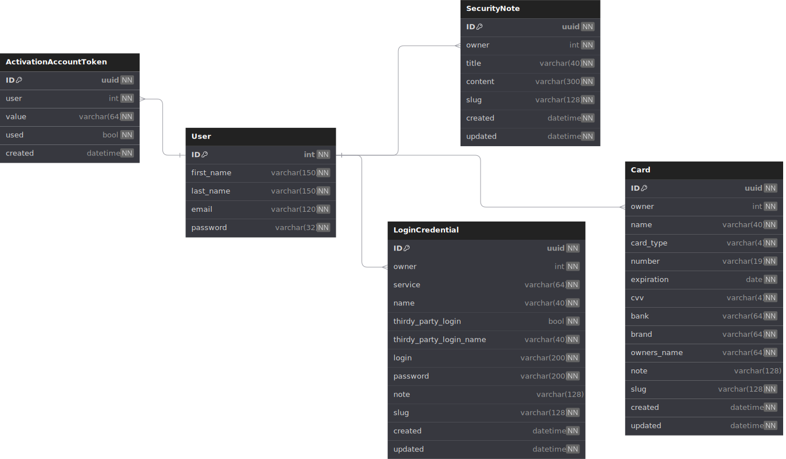

<h1 align="center">
  
  <br>
  sWarden
</h1>


Created in Django as an MVC Framework, sWarden works as a real prototype of an online password and credential manager. This project uses security concepts in a practical and descriptive way.

Both class-based views and function-based views were used, so that the different paradigms implemented by the Framework can be exemplified in a practical way.

It adds to Django's security measures an initial logic of what a honeypot would be, more than 150 test cases including 4 load tests to certify the integrity of the system and encryption of the data stored in the database, all applicable in Docker.

## Stack


## To-Do List

To check the to-do list and keep track of future implementations please check [To-Do List over here](https://lucasgoncsilva.github.io/swarden/TODO).

## Arch

The architecture can be detailed in general terms on two levels: web and database. The mechanics are abstracted to a general level, avoiding in-depth details that confuse rather than aggregate, presenting a behavioral vision on a “macro” scale following the flow of data without focusing on the “micro”, such as each action of each function. Below is the flow of information on the Web, followed by the structuring and architecture of the Database (For more details on the Database go to [https://dbdocs.io/lucasgoncsilva04/SWARDEN](https://dbdocs.io/lucasgoncsilva04/SWARDEN)):

### Web



### DB



## Contrib

Before copying anything, we recommend you to read our guidelines: [Code of Conduct](https://lucasgoncsilva.github.io/swarden/CODE_OF_CONDUCT.md), [Contributing](https://lucasgoncsilva.github.io/swarden/CONTRIBUTING), [Security](https://lucasgoncsilva.github.io/swarden/SECURITY) and [Support](https://lucasgoncsilva.github.io/swarden/SUPPORT).

Once done with it, fork this repo to create a copy at your repos and clone your version:

```sh
git clone git@github.com:<YOUR_REPO>/swarden.git
cd swarden
```

Now you are ready to follow the next step, described below.

## Running

### Requirements

- uv >= 0.5.13
- Python >= 3.9
- Docker >= 27

**uv** is basically the best project and dependency manager for Python. Check out the installation methods [here](https://docs.astral.sh/uv/).

### Environment Variables

Before starting with development and commands, it is important to define the environment variables in your development environment. Below is a list of which ones to set:

| Name                     |    Type     | Mandatory | Default               | Description                                  |
| :----------------------- | :---------: | :-------: | :-------------------- | :------------------------------------------- |
| `DJANGO_SETTINGS_MODULE` |    `str`    | Optional  | `'CORE.settings.dev'` | Defines the settings file to be used         |
| `CAPTCHA_TEST_MODE`      |   `bool`    | Optional  | `True`                | Allows captcha bypass on login               |
| `DATABASE_NAME`          |    `str`    | Optional  | `'postgres'`          | Defines database access name                 |
| `DATABASE_USER`          |    `str`    | Optional  | `'postgres'`          | Defines database access user                 |
| `DATABASE_PASSWORD`      |    `str`    | Optional  | `'postgres'`          | Defines database access password             |
| `DATABASE_HOST`          |    `str`    | Optional  | `'localhost'`         | Defines database access host                 |
| `ADMIN`                  |    `str`    | Optional  | `'__manager__'`       | Defines URI path to admin site               |
| `DEBUG`                  |   `bool`    | Optional  | `True`                | Defines traceback and debug infos at browser |
| `SECRET_KEY`             |    `str`    | Optional  | `'cw%t5...ba^m3)'`    | Defines general security stuff               |
| `ALLOWED_HOSTS`          | `list[str]` | Optional  | `['*']`               | Defines valid URLs to be used                |

Once ok with env vars, sync the uv with `uv.lock` - this will create a `.venv` by itself:

```sh
uv sync
```

> From here to below, run under `SWARDEN/` dir.

### Start Docker's Database

```sh
docker run --name psql_swarden -p 5432:5432 \
    -e POSTGRES_USER=postgres \
    -e POSTGRES_PASSWORD=postgres \
    -e POSTGRES_DB=postgres \
    -d postgres
```

### Start/Search for Database Migrations

```sh
uv run manager.py makemigrations
```

### Update Database Struct Based on New Migrations

```sh
uv run manager.py migrate
```

### Run Automated Tests

```sh
uv run manager.py test [--parallel N]  # N means num, integer
```

### Run Automated Tests w/ Coverage

```sh
uv run manager.py testwithcoverage
```

### Populate Database

```sh
uv run manager.py populateuser  # For users

# And then

uv run manager.py populatesecret  # For secrets
```

### Start Local Server

```sh
uv run manager.py runserver  # Default Django's server

# OR

uv run gunicorn CORE.wsgi:application --bind 0.0.0.0:8000  # Gunicorn at local
```

## License

This project is under [MPLv2 - Mozilla Public License Version 2.0](https://choosealicense.com/licenses/mpl-2.0/). Permissions of this weak copyleft license are conditioned on making available source code of licensed files and modifications of those files under the same license (or in certain cases, one of the GNU licenses). Copyright and license notices must be preserved. Contributors provide an express grant of patent rights. However, a larger work using the licensed work may be distributed under different terms and without source code for files added in the larger work.
