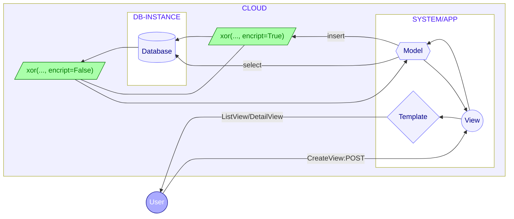

<h1 align='center'>SWARDEN</h1>


<h4 align='justify'>Criado em Django como Framework MVC, sWarden funciona como um protótipo real de gerenciador de senhas e credenciais online. Este projeto introduz e apresenta conceitos básicos de segurança de forma prática e descritiva. <br>
Foram utilizadas tanto class-based views quanto function-based views, de modo que os diferentes paradigmas implementados pelo Framework sejam exemplificados de forma prática. <br>
Agrega às medidas de segurança do Django uma lógica inicial do que seria um honeypot, mais de 40 casos de testes incluindo 4 testes de carga para atestar a integridade do sistema e criptografia nos dados armazenados em banco, tudo aplicável em Docker.</h4>

<br>
<hr>

<h2 align='center'>Tecnologias Aplicadas:</h2>


<br>
<hr>

<h2 align='center'>Features</h2>

- [x] CRUD dos diferentes tipos de segredos armazenados
- [x] Salvar mais de uma conta por serviço (e.g. duas contas do Instagram)
- [x] Exportar dados via e-mail (o mesmo utilizado para acesso ao sistema)
- [ ] Usar Autenticação em Duas Etapas
- [ ] Gerar senhas pseudo-aleatórias como sugestão da plataforma

<br>
<hr>

<h2 align='center'>Arquitetura</h2>



<h5 align='center'>sWarden's current CRUD architecture</h5>

<br>
<hr>

<h2 align='center'>Starting</h2>

### Buscar/iniciar Migrações (Atualizações) de Banco de Dados

``python3 manager.py makemigrations``

### Atualizar Estrutura do Banco de Dados com Novas Migrações

``python3 manager.py migrate``

### Iniciar Testes Automatizados

``python3 manager.py test``

### Popular Banco de Dados para Execução Local

``python3 manager.py populatedb``

### Iniciar o servidor

``python3 manager.py runserver``

<br>
<hr>

<h2 align='center'>Utilizando</h2>

### Criando uma Conta

Para iniciar, caso não tenha uma conta, crie uma acessando `/conta/registrar` ou seguindo o botão "Regsitrar-se", Preencha e envie o formulário. Feito isso, insira seu `username` e sua `password`, ambos informados no formulário anteriormente. Já possui uma conta? Acesse diretamente por `/conta/entrar` ou siga o botão "Entrar".

<hr>

### Compreendendo a Interface

Após acessar, a todo momento haverá uma barra de navegação no topo das páginas. Você pode utilizá-la para navegar entre os módulos do sistema e realizar algumas ações como:

* Criar e visualizar suas credenciais de login
* Criar e visualizar seus dados de cartões
* Criar e visualizar suas anotações seguras
* Sair do sistema

#### Página Principal

Esta página mostra a quantidade total de cada segredo (credenciais, cartões, anotações) e um breve histórico dos últimos registros feitos. Também permite acessar a página de criação e visualização de cada segredo

#### Página de Criação

Utilizando a barra de navegação (através dos menus dropdown) ou com um botão "Adicionar" na tela inicial você acessa a página de criação. Conforme o formulário é preenchido o campo `slug` - apenas leitura - é autopreenchido com a referência do segredo em questão. Você poderá utilizar esse campo para acessar esse mesmo segredo a partir da URL (e.g. `/segredo/cartao/:slug:`).

Preenchendo e enviando corretamente o formulário você cria um novo segredo com as informações escritas no formulário, sendo posteriormente redirecionado para a página de listagem dos segredos de mesmo tipo (credencial; cartão; anotação).

#### Página de Listagem

Esta página apresenta todos os segredos criados, um tipo por vez. Clickando em um segredo aqui indicado será apresentada uma tela detalhada desse segredo. Não havendo nenhum segredo, haverá uma mensagem indicando a situação com um botão para a tela de criação.

#### Página de Detalhe

Aqui é onde você visualiza os detalhes do segredo escolhido, informação por informação. Junto a isso, há três botões no topo da tela: azul (editar este segredo), vermelho (apagar este segredo) e cinza (adicionar um novo segredo).

<br>
<hr>

<h2 align='center'>To-Do List</h2>

- [ ] Completar a lista de [FEATURES](https://github.com/LucasGoncSilva/swarden#features).
- [ ] Criar as páginas `/sobre` e `/serviços`.
- [ ] Aplicar melhorias de feedback de caracteres nos campos de texto para cada segredo

<br>
<hr>

<h2 align='center'>Contrib</h2>

### Escrevendo Testes de Models

```py
class MyModelTestCase(TestCase):
    def setUp(self) -> None:
        self.model1: MyModel = MyModel.objects.create(...)

        self.model2: MyModel = MyModel.objects.create(...)

        self.model3: MyModel = MyModel.objects.create(...)

        self.model4: MyModel = MyModel.objects.create(...)

        self.model5: MyModel = MyModel.objects.create(...)

    def test_model_instance_validity(self) -> None:
        """Tests model instance of correct class"""

        for model in MyModel.objects.all():
            with self.subTest(model=model):
                self.assertIsInstance(model, MyModel)

    def test_model_key_value_assertion(self) -> None:
        """Tests model correct attribuition of value"""

        model1: MyModel = MyModel.objects.get(pk=self.model1.pk)

        self.assert...(...)
        ...

    def test_model_create_validity(self) -> None:
        """Tests model creation integrity and validation"""

        model1: MyModel = MyModel.objects.get(pk=self.model1.pk)
        model2: MyModel = MyModel.objects.get(pk=self.model2.pk)
        model3: MyModel = MyModel.objects.get(pk=self.model3.pk)
        model4: MyModel = MyModel.objects.get(pk=self.model4.pk)
        model5: MyModel = MyModel.objects.get(pk=self.model5.pk)

        self.assertEqual(MyModel.objects.all().count(), 5)

        self.assertTrue(model1.is_valid())
        self.assertTrue(model2.is_valid())
        self.assertTrue(model3.is_valid())
        self.assertFalse(model4.is_valid())
        self.assertFalse(model5.is_valid())

    def test_model_update_validity(self) -> None:
        """Tests model update integrity and validation"""

        MyModel.objects.filter(pk=self.model4.pk).update(...)

        MyModel.objects.filter(pk=self.model5.pk).update(...)

        for model in MyModel.objects.all():
            with self.subTest(model=model):
                self.assertTrue(model.is_valid())

    def test_model_delete_validity(self) -> None:
        """Tests model correct deletion"""

        for model in MyModel.objects.all():
            if not model.is_valid():
                model.delete()

        self.assertEqual(MyModel.objects.all().count(), <int>)

    def test_model_db_exception_raises(self) -> None:
        """Tests model correct integrity and validation with raised exceptions"""

        # Expecting raises
        params: list[dict[str, User | str]] = [
            {'field': 'value'},
            {'field': 'value'},
            {'field': 'value'},
            {'field': 'value'},
            {'field': 'value'},
            {'field': 'value'},
            {'field': 'value'},
            {'field': 'value'},
            {'field': 'value'},
        ]

        for case, scenario in create_scenarios(params):
            with self.subTest(scenario=case):
                with self.assertRaises(ValidationError):
                    with atomic():
                        instance: MyModel = MyModel(**scenario)
                        instance.full_clean()

        raise_kwargs: dict[str, dict[str, ...]] = {
            'model1': {...},
            'model2': {...},
            ...
        }

        for scenario in raise_kwargs.keys():
            with self.subTest(scenario=scenario):
                with self.assertRaises(Exception):
                    with atomic():
                        instance: MyModel = MyModel(**raise_kwargs[scenario])
                        instance.full_clean()

        # Not expecting raises
        for scenario in no_raise_kwargs.keys():
            with self.subTest(scenario=scenario):
                try:
                    instance: MyModel = MyModel(**no_raise_kwargs[scenario])
                    instance.full_clean()

                except Exception as e:
                    self.fail(
                        f'{scenario} raised unexpected exception:\n\n{e}'
                    )
```

<br>
<hr>

<h2 align='center'>Licença</h2>

This project is under [MPLv2 - Mozilla Public License Version 2.0](https://choosealicense.com/licenses/mpl-2.0/). Permissions of this weak copyleft license are conditioned on making available source code of licensed files and modifications of those files under the same license (or in certain cases, one of the GNU licenses). Copyright and license notices must be preserved. Contributors provide an express grant of patent rights. However, a larger work using the licensed work may be distributed under different terms and without source code for files added in the larger work.
