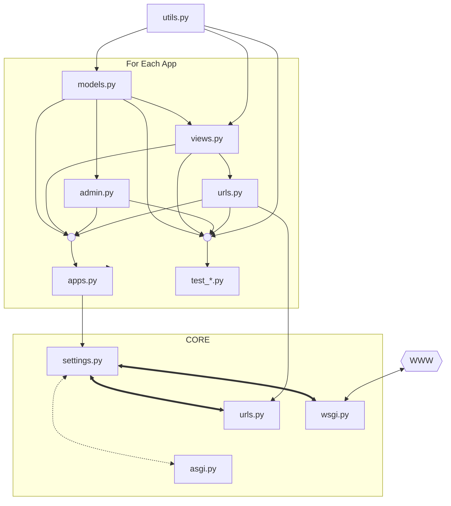

# Codebase

## Django Project Structure

When you create a new Django project using the command:

```bash
django-admin startproject <project_name>
```

You get a basic directory structure, which typically looks like this:

```
<project_name>
├── manage.py
└── <project_name>
    ├── __init__.py
    ├── settings.py
    ├── urls.py
    ├── asgi.py
    └── wsgi.py
```

Each of these files serves a critical purpose in the project's operation and interacts with application-specific files (`startapp <app_name>`).

## Core Files in a Django Project

### 1. `manage.py`

- Role: This is a command-line utility that helps manage your Django project. You use it to run development servers, perform database migrations, create applications, and more.
- Interaction:
  - Executes Django commands and setups up the environment by loading settings from `settings.py`.
  - Uses the `settings` module to understand project configurations when running commands like `runserver` or `migrate`.

### 2. `<project_name>/settings.py`

- Role: The central configuration file of your project. It defines project-level settings like database configurations, installed apps, middleware, templates, static files, and more.
- Interaction:
  - Applications: The `INSTALLED_APPS` section includes a list of apps that the project recognizes. When you create a new app using `startapp`, you need to add it here manually or with tools like `django-extensions`.
  - Database Models: Configures the database backend (e.g., SQLite, PostgreSQL) and connects it with the ORM models defined in app directories (`<app_name>/models.py`).
  - Middleware: Middleware classes defined in `settings.py` interact with app-level views and handle pre- and post-processing of requests.
  - Static/Media Files: Configurations for static files (e.g., CSS, JavaScript) and user-uploaded media files influence app-level templates.

### 3. `<project_name>/urls.py`

- Role: The URL routing configuration for the entire project. It maps incoming HTTP requests to views (functions or classes) defined in apps.
- Interaction:

  - Includes URLs from app-specific `urls.py` files. For example:

  ```python
  from django.urls import path, include

  urlpatterns = [
      path('admin/', admin.site.urls),
      path('blog/', include('blog.urls')),
  ]
  ```

  This tells Django to defer `/blog/` requests to the `blog` app's `urls.py`.

### 4. `<project_name>/wsgi.py`

- Role: Entry point for WSGI-compatible web servers (e.g., Gunicorn, uWSGI) to serve your Django application.
- Interaction:
  - Loads the project's `settings.py` to configure the application before serving requests.
  - Interacts indirectly with apps by routing requests via the `urls.py` file.

### 5. `<project_name>/asgi.py`

- Role: Entry point for ASGI-compatible web servers (e.g., Daphne, Uvicorn) for asynchronous web applications.
- Interaction:
  - Similar to `wsgi.py` but supports asynchronous handling.
  - Connects to asynchronous components like WebSockets or long-polling tasks defined in apps.

## Internal Structure of an App (`startapp <app_name>`)

When you run:

```bash
python manage.py startapp <app_name>
```

Django creates a directory structure like this:

```plaintext
<app_name>/
    __init__.py
    admin.py
    apps.py
    migrations/
        __init__.py
    models.py
    tests.py
    views.py
```

### 1. `<app_name>/models.py`

- Purpose: Defines the data models for the app. Each model corresponds to a table in the database.
- Interaction:
  - Registered in `INSTALLED_APPS` (via `settings.py`) so Django's ORM recognizes it.
  - Migrated to the database using `python manage.py makemigrations` and `migrate`.

### 2. `<app_name>/admin.py`

- Purpose: Configures how the app's models appear and behave in the Django admin interface.
- Interaction:

  - Registers models for management in the Django Admin Panel. For example:

  ```python
  from django.contrib import admin
  from .models import MyModel

  admin.site.register(MyModel)
  ```

### 3. `<app_name>/apps.py`

- Purpose: Contains the app's configuration class, which Django uses to recognize the app.
- Interaction:
  - Automatically included in `INSTALLED_APPS` if generated with `startapp`.
  - Can define app-specific signals or configurations.

### 4. `<app_name>/migrations/`

- Purpose: Stores migration files that define changes to the app's models and database schema.
- Interaction:
  - Created via `makemigrations` and executed via `migrate`.

### 5. `<app_name>/tests.py`

- Purpose: Contains test cases for the app.
- Interaction:
  - Can test models, views, and other logic by using Django's testing framework.

### 6. `<app_name>/views.py`

- Purpose: Defines the logic for handling requests and returning responses.
- Interaction:
  - Views are connected to URLs via the `urls.py` of the app or project.
  - Can render templates, return JSON responses, or handle form submissions.

### 7. `<app_name>/urls.py` (optional)

- Purpose: Defines URL patterns specific to the app.
- Interaction:

  - Included in the project's `urls.py` to define app-specific routes.
  - For example:

  ```python
  from django.urls import path
  from . import views

  urlpatterns = [
      path('', views.index, name='index'),
  ]
  ```

## How Core Files Interact with Apps

1. `settings.py`:

   - Recognizes the app through `INSTALLED_APPS`.
   - Configures database backends, middleware, and static file handling that the app relies on.

2. `urls.py`:

   - Routes app-specific URLs using the `include` function.

3. `wsgi.py` and `asgi.py`:

   - Serve the entire Django application, including the logic defined in apps.

4. `manage.py`:
   - Provides commands to run the development server, create migrations, or execute custom commands defined by the app.


