<h1 align="center">
  
  <br>
  SWARDEN
</h1>


Created in Django as an MVC Framework, sWarden works as a real prototype of an online password and credential manager. This project introduces and presents basic security concepts in a practical and descriptive way.

Both class-based views and function-based views were used, so that the different paradigms implemented by the Framework can be exemplified in a practical way.

It adds to Django's security measures an initial logic of what a honeypot would be, more than 140 test cases including 4 load tests to certify the integrity of the system and encryption of the data stored in the database, all applicable in Docker.

## Stack


## Arch

The architecture can be detailed in general terms on two levels: web and database. The mechanics are abstracted to a general level, avoiding in-depth details that confuse rather than aggregate, presenting a behavioral vision on a “macro” scale following the flow of data without focusing on the “micro”, such as each action of each function. Below is the flow of information on the Web, followed by the structuring and architecture of the Database (For more details on the Database go to [https://dbdocs.io/lucasgoncsilva04/SWARDEN](https://dbdocs.io/lucasgoncsilva04/SWARDEN)):

### Web



### DB


## Basic

Before starting with development and commands, it is important to define the environment variables in your development environment. Below is a list of which ones to set:

| Name                     |       Type       | Mandatory  |          Default           | Description                                  |
| :----------------------- | :--------------: | :--------: | :------------------------: | :------------------------------------------- |
| `DJANGO_SETTINGS_MODULE` |    `#!py str`    | `optional` | `#!py 'CORE.settings.dev'` | Defines the settings file to be used         |
| `CAPTCHA_TEST_MODE`      |   `#!py bool`    | `optional` |        `#!py True`         | Allows captcha bypass on login               |
| `DATABASE_NAME`          |    `#!py str`    | `optional` |     `#!py 'postgres'`      | Defines database access name                 |
| `DATABASE_USER`          |    `#!py str`    | `optional` |     `#!py 'postgres'`      | Defines database access user                 |
| `DATABASE_PASSWORD`      |    `#!py str`    | `optional` |     `#!py 'postgres'`      | Defines database access password             |
| `DATABASE_HOST`          |    `#!py str`    | `optional` |     `#!py 'localhost'`     | Defines database access host                 |
| `DEBUG`                  |   `#!py bool`    | `optional` |        `#!py True`         | Defines traceback and debug infos at browser |
| `SECRET_KEY`             |    `#!py str`    | `optional` |  `#!py 'cw%t5...ba^m3)'`   | Defines general security stuff               |
| `ALLOWED_HOSTS`          | `#!py list[str]` | `optional` |        `#!py ['*']`        | Defines valid URLs to be used                |

### Start/Search for Database Migrations

`#!sh python3 manager.py makemigrations`

### Update Database Struct Based on New Migrations

`#!sh python3 manager.py migrate`

### Run Automated Tests

`#!sh python3 manager.py test [--parallel N]`

### Run Automated Tests w/ Coverage

`#!sh python3 manager.py testwithcoverage`

### Populate Database for Local Exec

`#!sh python3 manager.py populateuser` for users

`#!sh python3 manager.py populatesecret` for secrets - after populate users

### Start Local Server

`#!sh python3 manager.py runserver`

## Using

### Creating an Account

To get started, if you don't have an account, create one by going to `/conta/registrar` or by following the "Registrar" button. Fill in and submit the form. Once this is done, enter your username and password, both of which you entered in the form above. Already have an account? Go directly to `/conta/entrar` or follow the "Entrar" button.

<hr>

### Understanding the Interface

After logging in, there will always be a navigation bar at the top of the pages. You can use it to navigate between the system modules and perform some actions such as:

- Create and view login credentials
- Create and view cards
- Create and view security notes
- Logout

#### Homepage

This page shows the total quantity of each secret (credentials, cards, notes) and a brief history of the last registrations made. It also allows you to access the creation and viewing page for each secret.

#### Creating Page

Using the navigation bar (via the dropdown menus) or an “Adicionar button on the home screen, you access the creation page.As the form is filled in, the `slug` field - read-only - is autofilled with the reference of the secret in question. You can use this field to access the same secret from the URL (e.g. `/segredo/cartao/:slug:`).

If you fill in and submit the form correctly, you will create a new secret with the information entered in the form, and you will then be redirected to the page listing secrets of the same type (credential; card; note).

#### Listing Page

This page shows all the secrets you have created, one type at a time. Clicking on a secret here will display a detailed screen for that secret.If there is no secret, there will be a message indicating the situation with a button to the creation screen.

#### Detail Page

This is where you see the details of your chosen secret, information by information. Next to this, there are three buttons at the top of the screen: blue (edit this secret), red (delete this secret) and gray (add a new secret).

## To-Do List

- [ ] Use 2FA
- [ ] Generate pseudo-random passwords as suggestion
- [ ] Create `/sobre` and `/serviços` pages
- [ ] Apply chars count feedback in text inputs

## Contrib

### Writing Models Tests

```py
class MyModelTestCase(TestCase):
    def setUp(self) -> None:
        self.model1: MyModel = MyModel.objects.create(...)

        self.model2: MyModel = MyModel.objects.create(...)

        self.model3: MyModel = MyModel.objects.create(...)

        self.model4: MyModel = MyModel.objects.create(...)

        self.model5: MyModel = MyModel.objects.create(...)

    def test_model_instance_validity(self) -> None:
        """Tests model instance of correct class"""

        for model in MyModel.objects.all():
            with self.subTest(model=model):
                self.assertIsInstance(model, MyModel)

    def test_model_special_str_method_return(self) -> None:
        """Tests model return value of __str__ method"""

        model: MyModel = MyModel.objects.get(pk=self.model.pk)

        self.assertEqual(model.__str__(), ...)

    def test_model_key_value_assertion(self) -> None:
        """Tests model correct attribuition of value"""

        model1: MyModel = MyModel.objects.get(pk=self.model1.pk)

        self.assert...(...)
        ...

    def test_model_create_validity(self) -> None:
        """Tests model creation integrity and validation"""

        model1: MyModel = MyModel.objects.get(pk=self.model1.pk)
        model2: MyModel = MyModel.objects.get(pk=self.model2.pk)
        model3: MyModel = MyModel.objects.get(pk=self.model3.pk)
        model4: MyModel = MyModel.objects.get(pk=self.model4.pk)
        model5: MyModel = MyModel.objects.get(pk=self.model5.pk)

        self.assertEqual(MyModel.objects.all().count(), 5)

        self.assertTrue(model1.is_valid())
        self.assertTrue(model2.is_valid())
        self.assertTrue(model3.is_valid())
        self.assertFalse(model4.is_valid())
        self.assertFalse(model5.is_valid())

    def test_model_update_validity(self) -> None:
        """Tests model update integrity and validation"""

        MyModel.objects.filter(pk=self.model4.pk).update(...)

        MyModel.objects.filter(pk=self.model5.pk).update(...)

        for model in MyModel.objects.all():
            with self.subTest(model=model):
                self.assertTrue(model.is_valid())

    def test_model_delete_validity(self) -> None:
        """Tests model correct deletion"""

        for model in MyModel.objects.all():
            if not model.is_valid():
                model.delete()

        self.assertEqual(MyModel.objects.all().count(), <int>)

    def test_model_db_exception_raises(self) -> None:
        """Tests model correct integrity and validation with raised exceptions"""

        # Expecting raises
        params: list[dict[str, MyModel | str]] = [
            {'field': 'value'},
            {'field': 'value'},
            {'field': 'value'},
            {'field': 'value'},
            {'field': 'value'},
            {'field': 'value'},
            {'field': 'value'},
            {'field': 'value'},
            {'field': 'value'},
        ]

        for case, scenario in create_scenarios(params):
            with self.subTest(scenario=case):
                with self.assertRaises(ValidationError):
                    with atomic():
                        instance: MyModel = MyModel(**scenario)
                        instance.full_clean()

        raise_kwargs: dict[str, dict[str, ...]] = {
            'model1': {...},
            'model2': {...},
            ...
        }

        for scenario in raise_kwargs.keys():
            with self.subTest(scenario=scenario):
                with self.assertRaises(Exception):
                    with atomic():
                        instance: MyModel = MyModel(**raise_kwargs[scenario])
                        instance.full_clean()

        # Not expecting raises
        no_raise_kwargs: dict[str, dict[str, ...]] = {
            'model1': {...},
            'model2': {...},
            ...
        }

        for scenario in no_raise_kwargs.keys():
            with self.subTest(scenario=scenario):
                instance: MyModel = MyModel(**no_raise_kwargs[scenario])
                instance.full_clean()
```

### Writing Views Tests

```py
class BaseExampleTestCase(TestCase):
    def setUp(self) -> None:
        User.objects.create_user(
            username='user',
            password='password',
            email='user@email.com',
        )

        self.CONSTANT: ... = ...
        self.CONSTANT: ... = ...


class Example[Create|List|Detail|Update|Delete]ViewTestCase(BaseExampleTestCase):
    def test_GET_anonymous_user(self) -> None:
        """GET /example/view | anonymous user"""

        # Anonymous user check
        self.assertTrue(get_user(self.client).is_anonymous)
        self.assertFalse(get_user(self.client).is_authenticated)

        res: HttpResponse = self.client.get(reverse(ENDPOINT))

        self.assertEqual(res.status_code, xxx)
        self.assertRedirects(res, reverse(ENDPOINT))

        res: HttpResponse = self.client.get(
            reverse(ENDPOINT), follow=True
        )

        # Success response check
        self.assertEqual(res.status_code, 200)
        self.assertTemplateUsed(res, TEMPLATE)
        # Anonymous user check
        self.assertTrue(get_user(self.client).is_anonymous)
        self.assertFalse(get_user(self.client).is_authenticated)

    def test_GET_authenticated_user(self) -> None:
        """GET /example/view | authenticated user"""

        # Anonymous user check
        self.assertTrue(get_user(self.client).is_anonymous)
        self.assertFalse(get_user(self.client).is_authenticated)

        self.assertTrue(self.client.login(username='user', password='password'))

        res: HttpResponse = self.client.get(reverse(ENDPOINT))

        # Success response check
        self.assertEqual(res.status_code, 200)
        self.assertTemplateUsed(res, TEMPLATE)
        # Logged user check
        self.assertFalse(get_user(self.client).is_anonymous)
        self.assertTrue(get_user(self.client).is_authenticated)

    def test_POST_anonymous_user(self) -> None:
        """POST /example/view | anonymous user"""

        # Anonymous user check
        self.assertTrue(get_user(self.client).is_anonymous)
        self.assertFalse(get_user(self.client).is_authenticated)

        res: HttpResponse = self.client.post(reverse(ENDPOINT), {DATA: HERE})

        self.assertEqual(res.status_code, xxx)
        self.assertRedirects(res, reverse(ENDPOINT))

        res: HttpResponse = self.client.post(
            reverse(ENDPOINT),
            {DATA: HERE},
            follow=True
        )

        # Success response check
        self.assertEqual(res.status_code, 200)
        self.assertTemplateUsed(res, TEMPLATE)
        # Logged user check
        self.assertTrue(get_user(self.client).is_anonymous)
        self.assertFalse(get_user(self.client).is_authenticated)

    def test_POST_authenticated_user(self) -> None:
        """POST /example/view | authenticated user"""

        # Anonymous user check
        self.assertTrue(get_user(self.client).is_anonymous)
        self.assertFalse(get_user(self.client).is_authenticated)

        self.assertTrue(self.client.login(username='user', password='password'))

        res: HttpResponse = self.client.post(
            reverse(ENDPOINT),
            {DATA: HERE},
        )

        # Success response check
        self.assertEqual(res.status_code, 200)
        self.assertTemplateUsed(res, TEMPLATE)
        # Logged user check
        self.assertFalse(get_user(self.client).is_anonymous)
        self.assertTrue(get_user(self.client).is_authenticated)
```

## Licença

This project is under [MPLv2 - Mozilla Public License Version 2.0](https://choosealicense.com/licenses/mpl-2.0/). Permissions of this weak copyleft license are conditioned on making available source code of licensed files and modifications of those files under the same license (or in certain cases, one of the GNU licenses). Copyright and license notices must be preserved. Contributors provide an express grant of patent rights. However, a larger work using the licensed work may be distributed under different terms and without source code for files added in the larger work.
